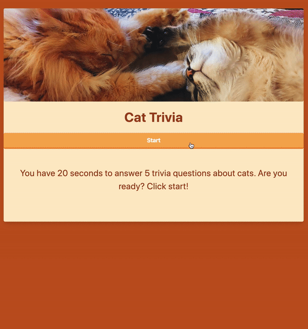

# TriviaGame

Cat trivia game

[Link to page](https://github.com/reekamaharaj/TriviaGame)

## Description
App that will ask 5 trivia questions about cats. The user has 25 seconds to answer to answer as many questions as they can. 

## How to use
After clicking the start button a 25 second timer will start counting down. Answer the questions by selecting the radio button next to the answer you chose. When the timer is done or the user clicks done, the results will show how many questions were answered correctly, incorrectly and how many weren't answered.

## Tech used
- Visual Studio
- HTML
- Tailwind CSS
- Javascript

## Role in Development 
Page layout and functionality